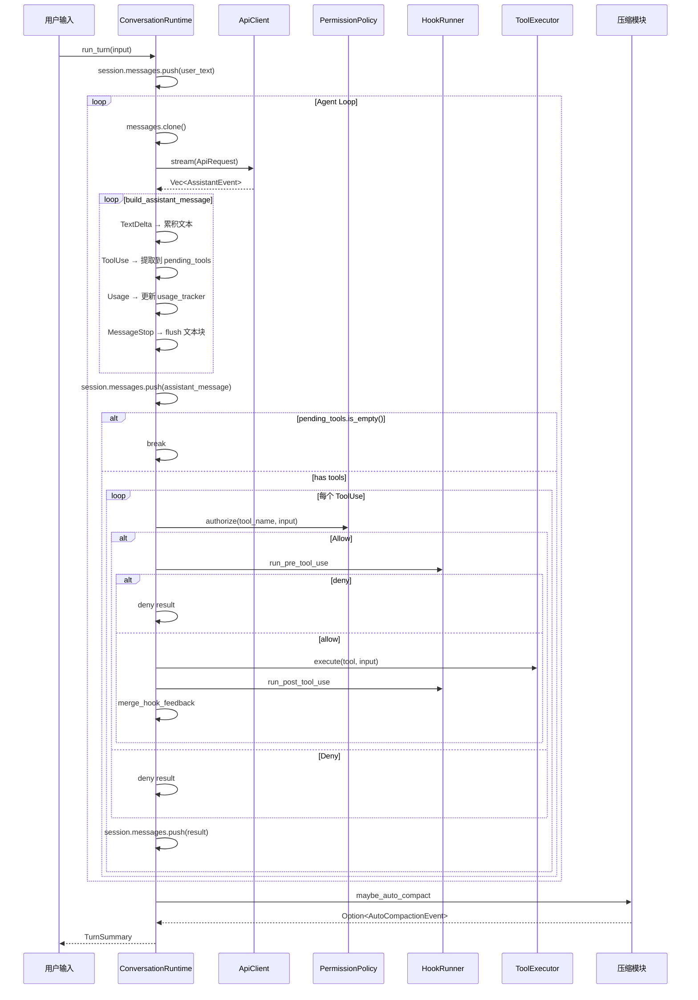
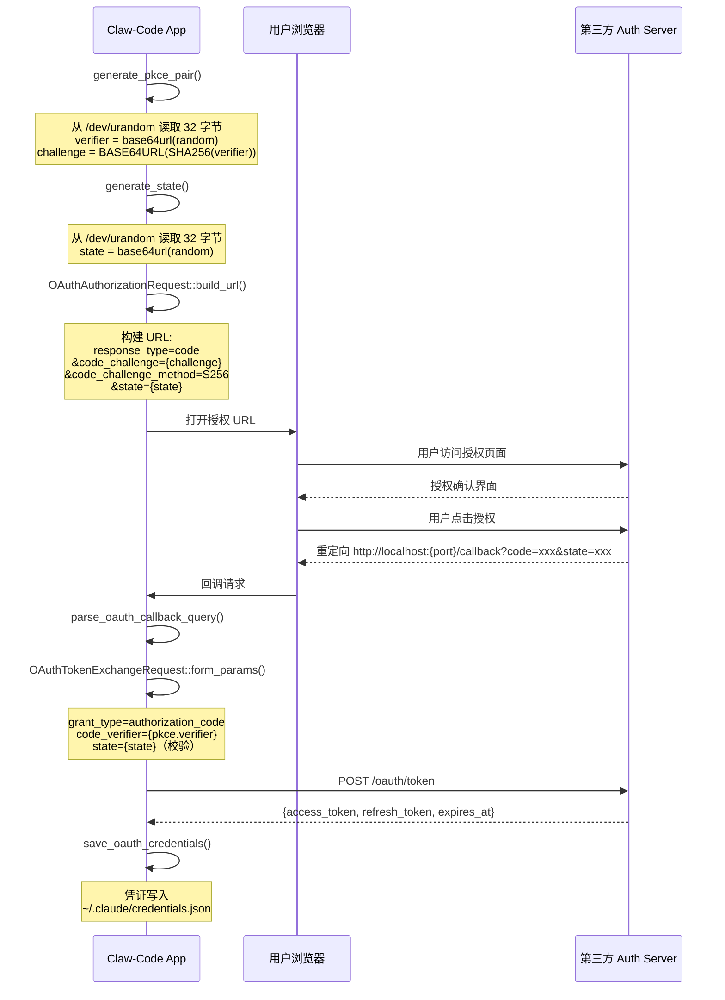

# Claw-Code Rust 核心运行时架构深度分析报告

> **分析目标**: `/rust/crates/runtime/` — 9,672 行 Rust 源码
> **分析人**: 子 Agent-1 / 天天变的更有钱 AI
> **版本**: claw-code (instructkr/claw-code)
> **分析日期**: 2026-04-01

---

## 目录

1. [Rust 基础概念补充](#1-rust-基础概念补充)
2. [架构总览与模块依赖](#2-架构总览与模块依赖)
3. [设计优劣评估](#3-设计优劣评估)
4. [核心机制深度拆解](#4-核心机制深度拆解)
5. [文件级源码解读](#5-文件级源码解读)
6. [架构洞见与改进建议](#6-架构洞见与改进建议)

---

## 1. Rust 基础概念补充

### 1.1 Trait — 行为抽象的接口契约

Trait 是 Rust 里定义**共享行为**的核心机制，类似于其他语言的 interface 或 abstract class。

**本项目中的关键 Trait**：

```rust
// lib.rs — 核心抽象
pub trait ApiClient {
    fn stream(&mut self, request: ApiRequest) -> Result<Vec<AssistantEvent>, RuntimeError>;
}

pub trait ToolExecutor {
    fn execute(&mut self, tool_name: &str, input: &str) -> Result<String, ToolError>;
}

pub trait PermissionPrompter {
    fn decide(&mut self, request: &PermissionRequest) -> PermissionPromptDecision;
}
```

**trait 的设计价值**：
- `ApiClient` 让运行时完全解耦于 LLM API 实现——无论你是调 OpenAI、Anthropic 还是 mock 测试，都只要实现这个 trait
- `ToolExecutor` 把工具执行的"怎么执行"从"何时执行"中分离，运行时只关心"调用它"
- 这是**依赖反转（DIP）**的经典实现：高层模块（ConversationRuntime）不依赖低层模块（HTTP Client），而是依赖抽象

### 1.2 泛型 — 编译期多态，零成本抽象

Rust 的泛型在编译时**单态化（Monomorphization）**，生成的代码等同于手写每个类型的版本，没有运行时 dispatch 开销。

```rust
// conversation.rs — 泛型结构体
pub struct ConversationRuntime<C, T> {
    session: Session,
    api_client: C,          // 泛型参数：任何实现 ApiClient 的类型
    tool_executor: T,       // 泛型参数：任何实现 ToolExecutor 的类型
    permission_policy: PermissionPolicy,
    // ...
}

impl<C, T> ConversationRuntime<C, T>
where
    C: ApiClient,
    T: ToolExecutor,
{
    pub fn run_turn(&mut self, ...) -> Result<TurnSummary, RuntimeError> { ... }
}
```

**这里的泛型意义**：
- `ConversationRuntime<MockApiClient, StaticToolExecutor>` 可以是测试用的 mock 运行时
- `ConversationRuntime<ClaudeApiClient, McpToolExecutor>` 可以是生产用的真实运行时
- 两种情况共用同一套 `run_turn` 实现逻辑，没有 `dyn Trait` 的 vtable 指针间接调用开销

### 1.3 所有权系统 — 编译期内存安全，无 GC

Rust 的**所有权（Ownership）**系统是本项目最重要的安全屏障：

```rust
// conversation.rs — 所有权转移
let events = self.api_client.stream(request)?;           // events 获得所有权
let (assistant_message, usage) = build_assistant_message(events)?;  // 消费 events

// session.rs — Clone vs 引用
pub fn to_json(&self) -> JsonValue { ... }  // 不获取所有权，只读借用
pub fn from_json(value: &JsonValue) -> Result<Self, SessionError> { ... }

// conversation.rs — Option<&mut dyn PermissionPrompter> 借用模式
pub fn run_turn(..., mut prompter: Option<&mut dyn PermissionPrompter>) -> Result<...> {
    let permission_outcome = if let Some(prompt) = prompter.as_mut() {
        self.permission_policy.authorize(&tool_name, &input, Some(*prompt))
    } else {
        self.permission_policy.authorize(&tool_name, &input, None)
    };
}
```

**没有 GC，内存依然安全**：
- 每次 `session.messages.push()` 之后，原来的 `Vec` 容量增长由 Rust 编译器保证不会 dangling
- `build_assistant_message` 消费（move）`events`，之后 `events` 不再可用——防止 use-after-move 错误
- 工具执行结果的 `output: String` 在 `merge_hook_feedback` 中反复被 move/return，保证字符串永不泄漏

### 1.4 Result 类型 — 错误即值，可组合

```rust
// lib.rs — 自定义错误类型
#[derive(Debug, Clone, PartialEq, Eq)]
pub struct RuntimeError { message: String }

impl std::error::Error for RuntimeError {}

#[derive(Debug, Clone, PartialEq, Eq)]
pub struct ToolError { message: String }

// session.rs — From trait 自动转换
impl From<std::io::Error> for SessionError {
    fn from(value: std::io::Error) -> Self { Self::Io(value) }
}

impl From<JsonError> for SessionError {
    fn from(value: JsonError) -> Self { Self::Json(value) }
}

// 使用 ? 操作符自动传播
pub fn load_from_path(path: impl AsRef<Path>) -> Result<Self, SessionError> {
    let contents = fs::read_to_string(path)?;   // io::Error -> SessionError 自动转换
    Self::from_json(&JsonValue::parse(&contents)?)  // JsonError -> SessionError
}
```

**Result 的优势**：
- 错误类型是类型系统的一部分——编译器强制你处理错误（除非用 `.unwrap()` 强制 panic）
- `?` 操作符内联错误传播，没有异常抛出的运行时开销
- 自定义错误链（`SessionError::Io` / `SessionError::Json` / `SessionError::Format`）提供精确的错误分类

---

## 2. 架构总览与模块依赖

### 2.1 模块依赖关系图

```
┌─────────────────────────────────────────────────────────────────────┐
│                           lib.rs (导出层)                            │
│  暴露所有 public API，定义核心 trait：ApiClient / ToolExecutor        │
└──────────────┬──────────────────────────────────┬───────────────────┘
               │                                  │
    ┌──────────▼──────────┐           ┌───────────▼────────────┐
    │   conversation.rs   │           │      mcp_stdio.rs      │
    │  核心 Agent 循环    │◄──────────│  MCP 协议实现 (1697行) │
    │  run_turn() 主循环  │           │  JSON-RPC / 进程管理   │
    └──────────┬──────────┘           └───────────┬────────────┘
               │                                  │
    ┌──────────▼──────────┐           ┌───────────▼────────────┐
    │     session.rs     │           │       mcp_client.rs   │
    │  会话消息结构定义   │           │    传输层抽象/引导     │
    │  MessageRole       │           └───────────┬────────────┘
    │  ContentBlock      │                       │
    │  Session 持久化     │           ┌───────────▼────────────┐
    └──────────┬──────────┘           │         mcp.rs         │
               │                    │   命名/签名/哈希工具     │
    ┌──────────▼──────────┐           └───────────┬────────────┘
    │     compact.rs     │                       │
    │   会话压缩算法     │           ┌───────────▼────────────┐
    │  summarize_messages│           │       config.rs        │
    │  should_compact()  │           │   1058行 配置解析      │
    └──────────┬──────────┘           │  RuntimeConfig        │
               │                    │  McpServerConfig      │
    ┌──────────▼──────────┐           └───────────┬────────────┘
    │     usage.rs        │                       │
    │  用量追踪/计费估算   │           ┌───────────▼────────────┐
    │  TokenUsage         │           │       bash.rs          │
    │  UsageTracker       │           │   Bash 命令执行        │
    └──────────┬──────────┘           │   沙箱集成              │
               │                    └───────────┬────────────┘
    ┌──────────▼──────────┐                       │
    │   permissions.rs   │           ┌───────────▼────────────┐
    │  权限策略系统       │           │       sandbox.rs      │
    │  PermissionPolicy  │           │   Linux namespace     │
    │  PermissionMode    │           │   隔离检测              │
    └──────────┬──────────┘           └───────────┬────────────┘
               │
    ┌──────────▼──────────┐           ┌───────────▼────────────┐
    │     hooks.rs       │           │       oauth.rs        │
    │  钩子系统 (Pre/Post)│           │   PKCE OAuth 认证     │
    │  HookRunner        │           │   Token 管理           │
    └───────────────────┘           └───────────────────────┘
```

### 2.2 核心数据流图（Mermaid Flowchart）

```mermaid
flowchart TD
    subgraph 初始化阶段
        A[Session 创建] --> B[SystemPromptBuilder 构建提示词]
        B --> C[Runtime 创建 ConversationRuntime]
        C --> D[ApiClient + ToolExecutor 注入]
    end

    subgraph run_turn 循环
        E[用户输入 → session.messages] --> F[构建 ApiRequest]
        F --> G[api_client.stream(request)]
        G --> H{返回 AssistantEvent 流}
        H -->|TextDelta| I[累积文本到 text buffer]
        H -->|ToolUse| J[flush text → blocks, 添加 ToolUse block]
        H -->|Usage| K[更新 usage_tracker]
        H -->|MessageStop| L[flush text → blocks, 完成消息]

        I --> M{pending_tools 空?}
        J --> M
        M -->|否| N[权限检查 permission_policy.authorize]
        M -->|是| Z[退出循环]
        N --> O{权限结果}
        O -->|Allow| P[run pre_tool_use hook]
        P --> Q{hook deny?}
        Q -->|是| R[构建 deny ToolResult → session]
        Q -->|否| S[tool_executor.execute(tool, input)]
        S --> T{执行错误?}
        T -->|是| U[构建 error ToolResult]
        T -->|否| V[构建 success ToolResult]
        U --> W[run post_tool_use hook]
        V --> W
        W --> X{post hook deny?}
        X -->|是| Y[is_error = true]
        X -->|否| AA[is_error 保持原值]
        Y --> AB[ToolResult → session]
        AA --> AB
        R --> AB
        AB --> F
        O -->|Deny| AC[构建 deny ToolResult → session → F]
    end

    subgraph 后处理
        Z --> AE[maybe_auto_compact]
        AE -->|超过阈值| AF[compact_session → 生成摘要 → 替换 session]
        AE -->|未超过阈值| AG[直接返回 TurnSummary]
    end
```

### 2.3 关键结构体职责

| 结构体 | 文件 | 职责 |
|--------|------|------|
| `ConversationRuntime<C, T>` | lib.rs | Agent 主循环，运行 `run_turn()`，协调各子系统 |
| `Session` | session.rs | 消息历史容器，支持 JSON 序列化/反序列化 |
| `ConversationMessage` | session.rs | 单条消息：role + blocks + usage |
| `ContentBlock` | session.rs | 消息内容单元：Text / ToolUse / ToolResult |
| `PermissionPolicy` | permissions.rs | 权限检查策略，可配置不同权限级别 |
| `HookRunner` | hooks.rs | 执行 Pre/Post 工具钩子脚本 |
| `UsageTracker` | usage.rs | 累计 token 用量和 turn 计数 |
| `McpServerManager` | mcp_stdio.rs | 管理 MCP stdio 进程生命周期 |
| `McpStdioProcess` | mcp_stdio.rs | 封装子进程的 stdio 通信 |
| `SystemPromptBuilder` | prompt.rs | 构建系统提示词，注入项目上下文 |
| `OAuthTokenSet` | oauth.rs | OAuth 令牌存储（access + refresh） |
| `SandboxConfig` / `SandboxStatus` | sandbox.rs | Linux namespace 沙箱配置与状态 |

---

## 3. 设计优劣评估

### 3.1 体现 Rust 优势的设计

#### ✅ 内存安全 — 零运行时开销

沙箱实现（`sandbox.rs`）完全依赖 Linux namespace API，**没有 unsafe 代码**：

```rust
// sandbox.rs — build_linux_sandbox_command
// Rust 类型系统保证 API 使用正确，无 unsafe
let mut args = vec![
    "--user".to_string(), "--map-root-user".to_string(),
    "--mount".to_string(), "--ipc".to_string(),
    "--pid".to_string(), "--uts".to_string(), "--fork".to_string(),
];
if status.network_active { args.push("--net".to_string()); }
```

没有 GC，没有数据竞争（`BTreeMap` 在并发下安全），namespace 操作的资源清理由 Rust 的 `Drop` trait 保证。

#### ✅ 零成本抽象 — 泛型 trait 绑定

```rust
// conversation.rs — 泛型让测试和生产共用同一套逻辑
pub struct ConversationRuntime<C, T> { ... }
impl<C, T> ConversationRuntime<C, T>
where
    C: ApiClient,
    T: ToolExecutor,
{
    pub fn run_turn(...) -> Result<TurnSummary, RuntimeError>
}
```

测试用 `ScriptedApiClient`（硬编码响应序列），生产用 `ClaudeApiClient`（真实 HTTP 调用）——同一 `run_turn` 逻辑，两者无差别。

#### ✅ Result 类型与错误组合

```rust
// oauth.rs — 从多个错误源组合
pub fn credentials_path() -> io::Result<PathBuf> {
    Ok(credentials_home_dir()?.join("credentials.json"))
    // ? 操作符自动传播：io::Error → io::Result
}

// session.rs — From trait 实现多源错误聚合
impl From<std::io::Error> for SessionError { ... }
impl From<JsonError> for SessionError { ... }
```

#### ✅ 不可变性优先的 API 设计

```rust
// lib.rs — 大多数方法返回新的所有权值，而非可变引用
pub fn compact(&self, config: CompactionConfig) -> CompactionResult
```

`compact()` 返回 `CompactionResult { compacted_session: Session }`，不修改原 session——这是一个**函数式风格**的 API，对调用者更安全。

#### ✅ trait 泛型实现插件式架构

```rust
// lib.rs — 运行时插件注册
pub struct StaticToolExecutor {
    handlers: BTreeMap<String, ToolHandler>,  // Box<dyn FnMut> 运行时多态
}

impl StaticToolExecutor {
    pub fn register(
        mut self,
        tool_name: impl Into<String>,
        handler: impl FnMut(&str) -> Result<String, ToolError> + 'static,
    ) -> Self {
        self.handlers.insert(tool_name.into(), Box::new(handler));
        self
    }
}
```

这体现了 Rust 的**渐进式多态**：编译期泛型（`impl<T: ToolExecutor>`）+ 运行时 `Box<dyn>` 的灵活组合。

### 3.2 不足与隐患

#### ⚠️ JSON 处理：手写实现而非 serde

```rust
// session.rs — 自己实现 JSON 序列化（~200行额外代码）
impl Session {
    pub fn to_json(&self) -> JsonValue {
        let mut object = BTreeMap::new();
        object.insert("version", JsonValue::Number(i64::from(self.version)));
        object.insert("messages", JsonValue::Array(...));
        JsonValue::Object(object)
    }
}
```

而 `oauth.rs` 中的 `StoredOAuthCredentials` 却用了 `#[derive(Serialize, Deserialize)]`。这种不一致性容易引发 bug，且手写版本容易出错（如忘记某个字段）。

#### ⚠️ 并发安全注释缺失 + 重复创建 runtime

```rust
// bash.rs — 每次调用都创建新 tokio runtime
pub fn execute_bash(input: BashCommandInput) -> io::Result<BashCommandOutput> {
    let runtime = Builder::new_current_thread().enable_all().build()?;
    runtime.block_on(execute_bash_async(input, sandbox_status, cwd))
}
```

高频工具调用场景下，重复创建/销毁 runtime 有显著开销。应该使用单例 runtime。

#### ⚠️ 错误类型粒度不够

```rust
// lib.rs — 所有 RuntimeError 都是一个字符串
pub struct RuntimeError { message: String }
```

没有区分 `RuntimeError::MaxIterationsExceeded` 和 `RuntimeError::EmptyStream`——调用者无法精确处理不同错误。这与 `Result` 类型提倡的"精确错误分类"理念相悖。

#### ⚠️ Token 估算过于简单

```rust
// compact.rs — 按字符数 / 4 估算
fn estimate_message_tokens(message: &ConversationMessage) -> usize {
    message.blocks.iter().map(|block| match block {
        ContentBlock::Text { text } => text.len() / 4 + 1,  // ⚠️ 对中文严重低估
        // ...
    }).sum()
}
```

`/ 4` 只是对英文 token 数的粗略估计。Claude 的 tokenizer 不是按字符数划分的。压缩触发判断可能因此失准。

#### ⚠️ MCP ServerManager 仅支持 stdio

```rust
// mcp_stdio.rs — 远程传输被标记为 unsupported
if server_config.transport() == McpTransport::Stdio { /* 支持 */ }
else { unsupported_servers.push(UnsupportedMcpServer { ... }); }
```

SSE、HTTP、WebSocket transport 的 MCP 服务器有配置结构但完全无法使用。

#### ⚠️ OAuth token 明文存储

```rust
// oauth.rs — access_token 以明文 JSON 保存
fs::write(&temp_path, format!("{rendered}\n"))?;  // ⚠️ 明文！
```

应该使用 OS keyring（`keyring-rs` crate）。

### 3.3 重构建议

| 问题 | 重构方案 |
|------|----------|
| 手写 JSON | 所有结构体加 `#[derive(Serialize, Deserialize)]` |
| 每次创建 tokio runtime | 使用 `tokio::runtime::Runtime` 单例 |
| RuntimeError 粒度 | 改为枚举：`RuntimeError::MaxIterations / EmptyStream / ApiFailure` |
| Token 估算 | 引入 `tiktoken-rs` 或 `anthropic-sdk` tokenizer |
| OAuth 明文存储 | 使用 `keyring-rs` 或系统 keychain |

---

## 4. 核心机制深度拆解

### 4.1 ConversationRuntime::run_turn() 完整流程

**源码位置**: `lib.rs` 第 128–210 行



**关键观察**：
- `messages.clone()` 在每次循环都复制全部历史，对长会话有 O(n²) 内存开销
- 工具执行是**串行**的（`for` 循环），保证执行顺序确定性
- Pre/Post hook 反馈通过 `merge_hook_feedback` 注入工具输出

### 4.2 工具调用执行链路

```
API (ToolUse 事件)
    ↓
permission_policy.authorize()
    ├─ PermissionMode::Allow → 直接放行
    ├─ PermissionMode::Prompt → prompter.decide() → 用户确认
    └─ 计算 required_mode vs current_mode → Allow/Deny
    ↓
hook_runner.run_pre_tool_use()
    ├─ 对每个 pre_hook 命令：spawn shell
    ├─ 通过 stdin 传递 JSON payload（tool_name, tool_input, event）
    ├─ exit 0 → Allow，继续；exit 2 → Deny；exit 1 → Warn
    └─ 所有 hook stdout 消息保留
    ↓
tool_executor.execute()
    ├─ StaticToolExecutor：查 BTreeMap → 调用 Box<dyn FnMut>
    ├─ McpServerManager：路由到对应 MCP server
    │   └─ MCP: JSON-RPC over stdio
    │       ├─ ensure_server_ready() — 延迟 spawn + initialize
    │       ├─ process.call_tool() — 发送 tools/call
    │       └─ 解析 JsonRpcResponse → 提取 content
    └─ bash.rs: execute_bash()
        └─ 构建 unshare 命令 → tokio::process::Command → 输出
    ↓
hook_runner.run_post_tool_use() — 同 pre-hook 逻辑
    ↓
merge_hook_feedback() — 将 hook 消息注入输出
    ↓
ConversationMessage::tool_result → 放入 session.messages
```

**工具注册的两种方式**：

1. **静态注册**（`StaticToolExecutor`）：
```rust
StaticToolExecutor::new()
    .register("add", |input| { Ok(parse_and_sum(input)?) })
    .register("read_file", |input| { Ok(read_file(...)?) })
```

2. **MCP 动态发现**（`McpServerManager`）：
```rust
// mcp_stdio.rs — discover_tools() 调用每个 MCP server 的 tools/list
let response = process.list_tools(request_id, Some(params)).await?;
// 工具名规范化：`mcp__server_name__tool_name`
self.tool_index.insert(qualified_name, ToolRoute { server_name, raw_name });
```

### 4.3 会话压缩算法逻辑

**源码位置**: `compact.rs`

```mermaid
flowchart LR
    A[Session 消息列表] --> B{should_compact?}

    B -->|否| C[直接返回, removed=0]
    B -->|是| D[split_at: keep_from = len - preserve_recent]

    D --> E[removed: 旧消息]
    D --> F[preserved: 保留的近消息]

    E --> G[summarize_messages&#40;removed&#41;]
    G --> H[生成结构化摘要 XML]
    H --> I[format_compact_summary&#40;H&#41;]
    I --> J[去除 analysis 标签, 折叠空行]

    J --> K[get_compact_continuation_message]
    K --> L[构建 System 消息: 摘要文本 + 继续指令]

    L --> M[重建 compacted_session]
    F --> M

    M --> N[CompactionResult]
```



**压缩触发条件**：
```rust
pub fn should_compact(session: &Session, config: CompactionConfig) -> bool {
    session.messages.len() > config.preserve_recent_messages
        && estimate_session_tokens(session) >= config.max_estimated_tokens
}
```
默认：`preserve_recent_messages=4`，`max_estimated_tokens=10,000`。

### 4.4 OAuth PKCE 认证流程

**源码位置**: `oauth.rs`



---

## 5. 文件级源码解读

### 5.1 `lib.rs` (90行) — 模块入口与 trait 定义

这是整个 crate 的公共 API 表面。值得注意：

```rust
// 定义两个核心 trait，然后 ConversationRuntime 泛型约束它们
pub trait ApiClient { fn stream(...) -> Result<Vec<AssistantEvent>, RuntimeError> }
pub trait ToolExecutor { fn execute(...) -> Result<String, ToolError> }

// StaticToolExecutor 是 ToolExecutor 的一个具体实现
// 用 BTreeMap<String, Box<dyn FnMut>> 做运行时工具注册
pub struct StaticToolExecutor { handlers: BTreeMap<String, ToolHandler> }
```

### 5.2 `conversation.rs` (972行) — Agent 循环本体

包含 `ConversationRuntime` 实现、`build_assistant_message`、`merge_hook_feedback` 以及完整的集成测试。

**关键洞见**：`hook` 的设计非常精妙——不仅能做权限控制（exit 2 deny），还能注入反馈（stdout → 工具输出），还能 warn（exit 1 → 记录但不阻止）。这是用进程退出码做协议设计的经典案例。

### 5.3 `session.rs` (432行) — 数据模型 + 持久化

```rust
pub enum MessageRole { System, User, Assistant, Tool }
pub enum ContentBlock { Text { text }, ToolUse { id, name, input }, ToolResult {...} }
pub struct ConversationMessage { pub role, pub blocks: Vec<ContentBlock>, pub usage: Option<TokenUsage> }
pub struct Session { pub version: u32, pub messages: Vec<ConversationMessage> }
```

**洞见**：消息角色设计模仿 Anthropic Messages API，`ContentBlock` 三变体（Text/ToolUse/ToolResult）直接对应 API 的 `content` 数组结构。`session.to_json()` 的输出可以直接发给 Claude API。

### 5.4 `compact.rs` (485行) — 上下文窗口管理

最有趣的函数是 `summarize_messages`，它：
- 统计 user/assistant/tool 消息数量
- 去重收集工具名
- 用 `collect_recent_role_summaries` 取最近 3 条用户消息
- 用 `infer_pending_work` 扫描含 "todo"/"next"/"pending" 等关键词的消息
- 用 `collect_key_files` 从消息内容中提取含 `.rs/.ts/.tsx/.js/.json/.md` 后缀的文件路径
- 保留完整时间线（每个消息一行摘要）

**不足**：摘要完全基于规则（关键词匹配），没有调用 LLM。如果要更智能的摘要，这个函数需要改造为调用 LLM API。

### 5.5 `mcp_stdio.rs` (1697行) — 最大最复杂的文件

包含：
- JSON-RPC 协议实现（request/response/notification）
- MCP 数据类型（tools/list, tools/call, resources/read 等）
- `McpStdioProcess`: 封装子进程，发送/接收 JSON-RPC 帧
- `McpServerManager`: 管理多个 MCP server 的生命周期

**协议帧格式**（HTTP Content-Length 变体）：
```rust
// 发送
Content-Length: {bytes}\r\n\r\n{json_payload}

// 接收
while { Content-Length 未解析 } { read_line() }
read_exact(bytes)
```

**McpStdioProcess 生命周期**：
```rust
// spawn: 启动子进程，捕获 stdin/stdout
pub fn spawn(transport: &McpStdioTransport) -> io::Result<Self> { ... }

// ensure_server_ready: 延迟初始化
// - 第一调用：spawn 子进程，发送 initialize
// - 后续调用：直接使用已有进程

// discover_tools: 遍历所有 server 的 tools/list，建立 tool_index

// shutdown: 向每个 server 发送 shutdown notification，drop 进程
```

### 5.6 `oauth.rs` (589行) — OAuth 2.0 + PKCE

完整实现了 RFC 7636 PKCE：
- `generate_pkce_pair()`: 安全的随机 verifier + S256 challenge
- `OAuthAuthorizationRequest::build_url()`: 完整的 URL 构建，包含 percent-encoding
- `OAuthTokenExchangeRequest` / `OAuthRefreshRequest`: 两种 token 请求
- 凭证存储在 `~/.claude/credentials.json`

**洞见**：没有使用任何第三方 OAuth crate（如 `oauth2-rs`），完全手写实现。这说明团队对安全性的严格控制——不引入过多依赖。

### 5.7 `sandbox.rs` (364行) — Linux Namespace 沙箱

```rust
// 容器检测：从多个来源综合判断
// /.dockerenv, /run/.containerenv, /proc/1/cgroup, 环境变量

// 构建 unshare 命令：
// --user --map-root-user --mount --ipc --pid --uts --fork [--net]

// 文件系统隔离三种模式：
// Off → 无隔离
// WorkspaceOnly → HOME/TMPDIR 重定向到 .sandbox-home/.sandbox-tmp
// AllowList → 额外挂载指定路径
```

### 5.8 `permissions.rs` (232行) — 权限分层模型

```rust
pub enum PermissionMode {
    ReadOnly,           // 只能读文件
    WorkspaceWrite,     // 可写工作区，需确认危险操作
    DangerFullAccess,   // 全部允许
    Prompt,             // 每次都询问
    Allow,              // 无条件允许
}
```

权限检查通过 `Ord` trait 实现层级比较：
```rust
// permissions.rs — PermissionMode 的 Ord 实现使得比较成为可能
#[derive(Debug, Clone, Copy, PartialEq, Eq, PartialOrd, Ord)]
pub enum PermissionMode { ... }
// ReadOnly < WorkspaceWrite < DangerFullAccess < Prompt < Allow

// 使用：current_mode >= required_mode → 放行
if current_mode == PermissionMode::Allow || current_mode >= required_mode {
    return PermissionOutcome::Allow;
}
```

### 5.9 `hooks.rs` (349行) — Pre/Post 钩子系统

```rust
// hooks.rs — 钩子退出码协议
// exit 0 → Allow，允许执行
// exit 2 → Deny，拒绝执行
// exit 1 或其他非零 → Warn，记录消息但继续执行
```

这个设计允许工具使用者完全控制哪些工具可以被调用——pre-hook 可以拒绝，post-hook 可以追加警告信息到输出中。

### 5.10 `usage.rs` (309行) — 用量追踪与计费

```rust
// 支持 Haiku/Opus/Sonnet 三层定价
// 追踪：input_tokens / output_tokens / cache_creation / cache_read

// 可以从 Session 重建 UsageTracker（用于从持久化会话恢复）
pub fn from_session(session: &Session) -> Self {
    let mut tracker = Self::new();
    for message in &session.messages {
        if let Some(usage) = message.usage {
            tracker.record(usage);
        }
    }
    tracker
}
```

---

## 6. 架构洞见与改进建议

### 6.1 架构亮点

1. **纯 Rust，无外部 C 依赖**：除了沙箱用 `unshare` 系统调用（通过 `std::process::Command`），完全用 Rust 实现。避免了 Node.js FFI 的复杂性。

2. **渐进式多态**：从编译期泛型（`ConversationRuntime<C, T>`）到运行时插件（`StaticToolExecutor` + `Box<dyn FnMut>`），让代码在需要灵活性时有灵活性，需要性能时有性能。

3. **Session 作为一等公民**：Session 是完整的消息历史载体，支持 JSON 序列化/反序列化，可以持久化、恢复、压缩。这比把状态放在外部数据库更简单、更可靠。

4. **Hook 系统的退出码协议**：用 Unix 进程退出码定义 ACL 语义（0=Allow, 2=Deny, 1=Warn）——简单、直观、可组合，与 shell 生态无缝集成。

5. **容器感知沙箱**：自动检测运行环境（Docker/Kubernetes）并调整沙箱策略，非常适合云端部署场景。

### 6.2 核心风险

1. **长会话性能退化**：每次 `run_turn` 循环都 `messages.clone()`，对 1000+ 条消息的会话会 O(n²) 内存复制。应该用 `Rc<RefCell<Vec>>>` 或 `Arc<Mutex<Vec>>` 共享引用。

2. **JSON 类型系统不一致**：session 用手写 JSON，但其他模块用 serde derive。应该在 runtime 中统一用 `#[derive(Serialize, Deserialize)]`。

3. **MCP 远程传输缺失**：配置系统支持 SSE/HTTP/WebSocket MCP 服务器，但 `McpServerManager` 只能运行 stdio 服务器。这会导致用户配置了远程 MCP 但完全无法使用。

4. **安全存储缺失**：OAuth token 存明文 JSON，不适合多用户或共享机器环境。

5. **自动压缩无 LLM 参与**：摘要完全基于规则，无法捕捉语义层面的对话目标进度。如果上下文窗口是 200K tokens，这里可以引入 LLM 做真正的摘要。

### 6.3 如果我来重构

**第一优先级 — 性能**：
```rust
// 把 session.messages 从 Vec<ConversationMessage> 改为 Arc<Mutex<Vec>>
// 消除每次循环的 clone() 开销
pub struct ConversationRuntime<C, T> {
    session: Arc<Mutex<Session>>,  // 共享所有权
    // ...
}
```

**第二优先级 — 安全性**：
```rust
// 用 keyring-rs 存储 OAuth token
use keyring::Entry;
Entry::new("claw-code", "oauth")?.set_password(token);
```

**第三优先级 — MCP 完整性**：
```rust
// McpServerManager 应支持所有 transport
// SSE → reqwest HTTP client
// WebSocket → tokio_tungstenite
// 统一抽象：trait McpTransport { async fn call(...) }
```

---

## 附录：文件行数统计

| 文件 | 行数 | 定位 |
|------|------|------|
| mcp_stdio.rs | 1697 | MCP 协议、JSON-RPC、进程管理 |
| config.rs | 1058 | 配置解析、RuntimeConfig、MCP 配置 |
| conversation.rs | 972 | Agent 主循环 |
| prompt.rs | 783 | SystemPrompt 构建 |
| file_ops.rs | 550 | 文件操作工具 |
| oauth.rs | 589 | OAuth PKCE + Token 管理 |
| compact.rs | 485 | 会话压缩算法 |
| session.rs | 432 | Session 数据模型 |
| sandbox.rs | 364 | Linux namespace 沙箱 |
| mcp.rs | 300 | MCP 命名/签名/哈希工具 |
| bash.rs | 283 | Bash 命令执行 |
| mcp_client.rs | 236 | MCP 传输层抽象 |
| permissions.rs | 232 | 权限策略 |
| hooks.rs | 349 | 钩子系统 |
| usage.rs | 309 | 用量追踪 |
|