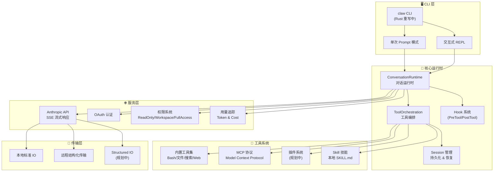

# claw-code 产品方案文档

> 项目地址：https://github.com/instructkr/claw-code
> 分析日期：2026-04-01
> 分析人：天天变的更有钱 AI 助手

---

## 一、项目概述

### 1.1 背景故事

2026年3月31日凌晨4点，Claude Code 源码意外泄露。GitHub 用户 @instructkr 迅速行动，在 2 小时内完成了从 TypeScript 到 Python 的干净室重写，并将源码公开托管。项目在发布 2 小时内获得了 50,000+ stars，成为 GitHub 历史上最快达到该里程碑的项目。

整个重写工作通过 [oh-my-codex (OmX)](https://github.com/Yeachan-Heo/oh-my-codex) 驱动——这是一个基于 OpenAI Codex 的工作流编排层，使用 `$team` 模式进行并行代码审查，`$ralph` 模式进行持久化执行验证。

### 1.2 核心定位

> **Better Harness Tools, not merely storing the archive of leaked Claude Code**

claw-code 是一个**AI Agent CLI 工具的 Harness 引擎**，核心价值在于：
- 提供一个与模型无关的 Agent 运行时框架
- 支持通过工具（Tools）扩展 AI 的能力边界
- 支持多会话、多插件、多层级的工具编排

### 1.3 项目现状

| 维度 | 现状 |
|------|------|
| GitHub Stars | 50,000+ |
| 官方定位 | 干净室重写，非 Claude 官方 |
| 主要语言 | Python（已完成）+ Rust（开发中） |
| 许可证 | MIT |
| 赞助商 | instructkr GitHub Sponsors |

---

## 二、产品架构

### 2.1 整体架构图



### 2.2 Rust 架构（当前开发主线）

```
rust/
├── Cargo.toml              # Workspace 根配置
└── crates/
    ├── api/                # Anthropic API 客户端 + SSE 流式解析
    ├── commands/           # 斜杠命令（/help, /status, /model 等）
    ├── compat-harness/    # TS 源码特征提取工具
    ├── runtime/            # 核心运行时（会话、权限、MCP、提示词）
    ├── rusty-claude-cli/   # CLI 主程序（claw 二进制）
    └── tools/              # 内置工具集实现
```

| Crate | 职责 | 核心文件 |
|-------|------|---------|
| `api` | HTTP 客户端、SSE 流解析、认证 | `client.rs`, `sse.rs`, `types.rs` |
| `commands` | 斜杠命令注册与帮助生成 | `lib.rs` |
| `compat-harness` | 从上游 TS 源码提取工具/提示词清单 | `lib.rs` |
| `runtime` | 对话循环、配置加载、会话持久化、权限策略、MCP 客户端 | `conversation.rs`, `config.rs`, `session.rs` |
| `rusty-claude-cli` | REPL、一次性 prompt、流式渲染、CLI 参数解析 | `main.rs`, `render.rs`, `args.rs` |
| `tools` | 工具规格定义与执行：Bash/文件/搜索/Web/Todo/Agent 等 | `lib.rs` |

### 2.3 Python 架构（已完成重写）

```
src/
├── models.py               # 数据类定义（子系统、模块、回溯状态）
├── commands.py             # Python 侧命令端口元数据
├── tools.py                # Python 侧工具端口元数据
├── port_manifest.py        # 当前 Python 重写清单
├── query_engine.py         # 重写进度查询引擎
├── main.py                 # CLI 入口（manifest/summary/commands/tools）
├── task.py / tasks.py      # 任务抽象
├── context.py              # 上下文管理
├── history.py              # 对话历史管理
├── runtime.py              # 运行时核心
├── bootstrap*.py           # 启动引导
├── coordinator/            # 协调器（多 Agent 编排）
├── assistant/              # 助手会话管理
├── bridge/                 # 桥接层（TS ↔ Python）
├── cli/                    # CLI 处理程序
├── hooks/                  # 钩子系统
├── plugins/                # 插件系统
├── services/               # 服务层（API、MCP、OAuth 等）
├── skills/                 # 技能系统（本地 + MCP）
├── screens/                # 终端 UI 屏幕
├── server/                 # 服务端
├── voice/                  # 语音模块
├── vim/                    # Vim 集成
├── native_ts/              # 原生 TypeScript 桥接
├── upstreamproxy/          # 上游代理
└── 更多子模块...
```

---

## 三、核心模块拆解

### 3.1 对话运行时（ConversationRuntime）

**职责：** 驱动整个 Agent 的主循环——接收用户输入 → 调用 LLM → 解析工具调用 → 执行工具 → 循环直到完成。

**关键能力：**
- 流式 SSE 响应处理
- 工具调用解析与分发
- 会话历史管理（compact、恢复）
- 用量追踪（token 计数与费用）
- 扩展思考（thinking blocks）

### 3.2 工具系统（Tool System）

**内置工具矩阵：**

| 类别 | 工具 | 说明 |
|------|------|------|
| 文件 | ReadFile, WriteFile, EditFile | 读写编辑本地文件 |
| 搜索 | GlobSearch, GrepSearch | glob 通配和内容搜索 |
| 执行 | Bash | 本地 shell 命令执行 |
| Web | WebSearch, WebFetch | 联网搜索和网页抓取 |
| Agentic | Agent, Task* | 子 Agent 和任务编排 |
| 团队 | Team* | 多 Agent 协作 |
| 辅助 | TodoWrite, NotebookEdit, Skill | 任务列表、Notebook、技能 |
| MCP | MCPTool, ListMcpResources | MCP 协议工具 |
| 配置 | ConfigTool, ToolSearchTool | 配置和工具搜索 |
| 计划 | ScheduleCronTool | 定时任务 |

### 3.3 MCP 协议支持

Model Context Protocol（MCP）是 Claude 原生的工具扩展协议。claw-code 支持：
- MCP 服务端生命周期管理（启动/停止）
- MCP 工具的动态发现
- MCP 资源读写
- MCP 认证（McpAuthTool）

### 3.4 权限系统

三级权限模式：

| 模式 | 说明 |
|------|------|
| `read-only` | 仅读取文件，不能写或执行命令 |
| `workspace-write` | 只能在当前工作目录写入和执行 |
| `danger-full-access` | 完全访问（默认） |

支持配置文件中预设 `dontAsk`，跳过交互确认。

### 3.5 Hook 系统

支持 PreToolUse / PostToolUse 钩子，可用于：
- 工具调用前后的日志记录
- 内容审核和过滤
- 工具参数的动态修改
- 权限增强

### 3.6 会话与持久化

- 会话历史存储在本地文件系统
- 支持通过 `/session [id]` 恢复历史会话
- 支持 `/compact` 压缩历史（减少 token 消耗）
- 支持会话导出（Markdown / JSON）

### 3.7 插件系统

- 内置插件 + 第三方插件安装
- 支持 marketplace 在线安装
- 插件可扩展：工具、命令、钩子、MCP 连接

---

## 四、产品路线图

### 4.1 已完成 ✅

- [x] Anthropic API + SSE 流式响应
- [x] OAuth 登录/登出
- [x] 交互式 REPL
- [x] 内置工具集（Bash、文件、搜索、Web、Todo、Agent、Skill）
- [x] CLAUDE.md / 项目记忆
- [x] 配置文件层级（.claude.json）
- [x] 权限系统
- [x] MCP 服务端生命周期管理
- [x] 会话持久化与恢复
- [x] 扩展思考（thinking blocks）
- [x] 用量追踪
- [x] Git 集成
- [x] Markdown 终端渲染（ANSI）
- [x] 模型别名（opus/sonnet/haiku）
- [x] 斜杠命令（/status, /compact, /clear, /model, /cost 等）

### 4.2 开发中 🔧

- [x] Rust 重写（~20K 行，6 个 crates）
- [ ] 插件系统完整实现
- [ ] Skills 注册表
- [ ] Hook 运行时执行（目前仅支持配置解析）

### 4.3 规划中 📋

- [ ] 完整的结构化 IO / 远程传输层
- [ ] MCP 工具完整实现（当前为 MVP）
- [ ] 更多 Agent 编排命令（/agents, /team）
- [ ] LSP 工具（语言服务器协议集成）
- [ ] 远程触发器（RemoteTrigger）

---

## 五、与 Claude Code 的对比

| 维度 | Claude Code（原始） | claw-code（重写） |
|------|-------------------|------------------|
| 语言 | TypeScript | Python + Rust |
| 工具集 | 完整（约30+工具） | MVP（约15个内置工具） |
| 插件系统 | 完整 | 缺失（规划中） |
| Hook 运行时 | 完整 | 仅配置解析 |
| CLI 命令 | 丰富（20+命令族） | 基础（~15个斜杠命令） |
| 结构化传输 | 支持 | 规划中 |
| 授权 | 需官方许可 | 开源干净室重写 |

---

## 六、竞品分析

| 竞品 | 语言 | 特点 | 与 claw-code 差异 |
|------|------|------|-----------------|
| Claude Code | TypeScript | 官方原生 CLI | 需官方账号授权 |
| OpenHands | Python | 开源 AI Agent | 侧重浏览器自动化 |
| Continue | TypeScript | VS Code 插件 | 面向 IDE |
| Tabnine | 多语言 | AI 代码补全 | 非 Agent 框架 |
| cursor-chat | TypeScript | IDE 内嵌 Agent | 与编辑器深度绑定 |

**claw-code 的差异化定位：**
1. 最快的 50K Stars 增长——社区认可度高
2. Python + Rust 双轨推进，兼顾开发效率与性能
3. 专注 Harness 引擎，强调工具编排能力
4. 开源免费，无需官方账号

---

## 七、目标用户画像

1. **AI Power User**：如 WSJ 报道中提到的 Sigrid Jin，年消耗 250 亿 tokens 的重度用户
2. **Harness 工程师**：研究 Agent 系统架构、工具编排、运行时上下文的开发者
3. **全栈开发者**：需要 AI 辅助完成代码编写、测试、部署的工程师
4. **非技术背景用户**：如律师、医生、牙医等通过 Claude Code 构建行业应用的非软件工程师

---

## 八、价值主张

> **一个高性能、高可扩展的 AI Agent Harness 引擎，让任何人都能通过自然语言驱动复杂的开发工作流。**

- 🚀 **速度**：Rust 重写版提供接近原生的执行效率
- 🔧 **工具化**：MCP 协议支持无限扩展工具集
- 🛡️ **安全**：细粒度权限控制，按需降级
- 💾 **记忆**：CLAUDE.md + 会话持久化，项目级上下文保持
- 🔌 **插件生态**：插件系统规划完善，未来可期
