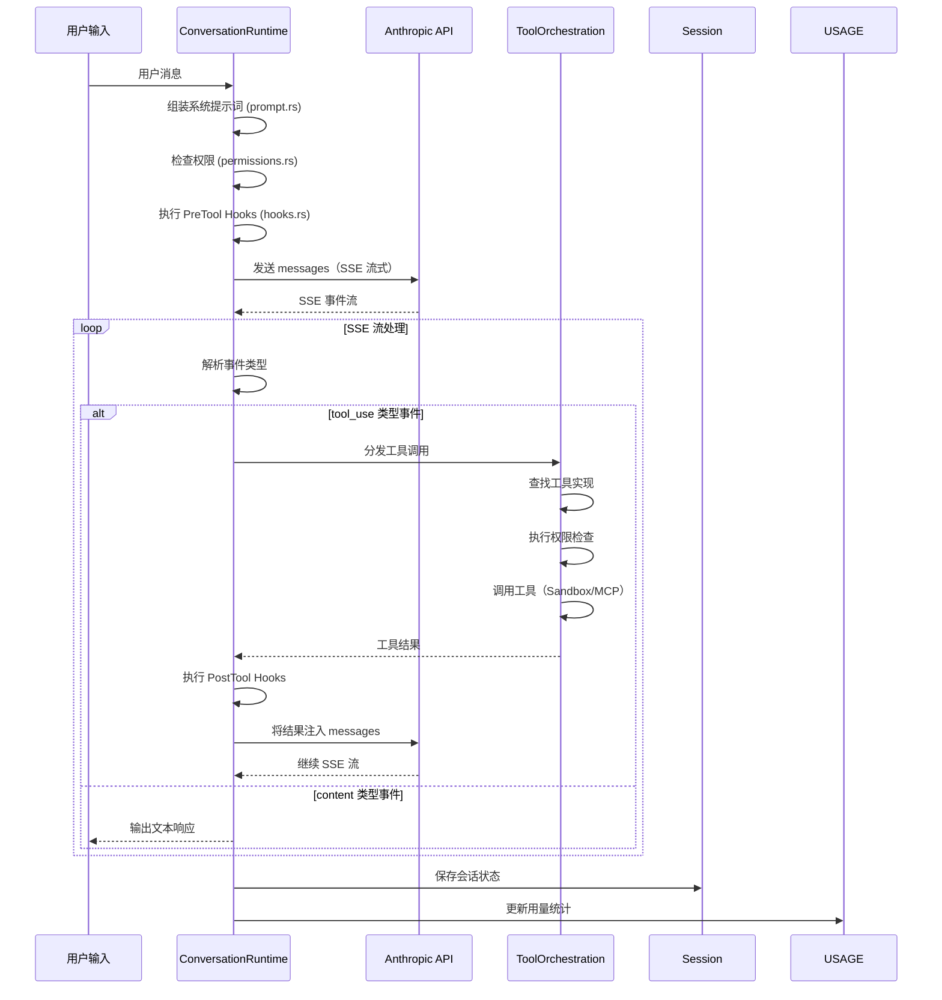
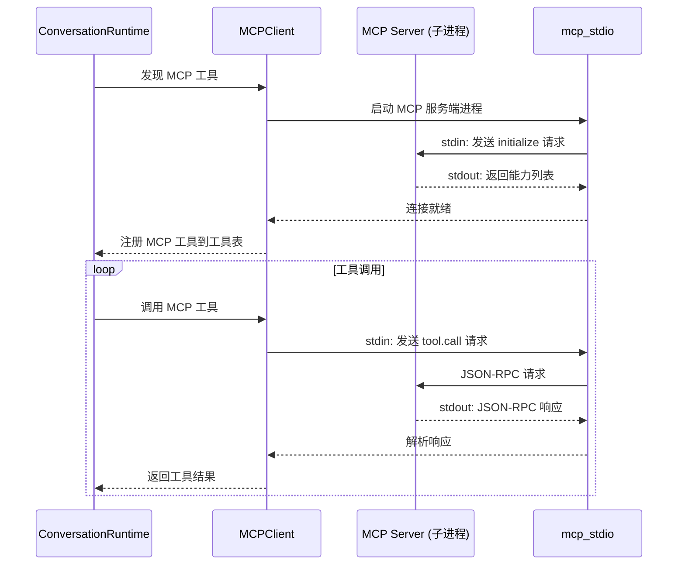

# claw-code 技术方案文档

> 项目地址：https://github.com/instructkr/claw-code
> 分析日期：2026-04-01
> 分析人：天天变的更有钱 AI 助手

---

## 一、技术架构总览

### 1.1 双语言架构

claw-code 采用 **Python + Rust 双轨并行** 的开发策略：

```
Python（已完成重写）
  → 快速迭代、业务逻辑层、工具端口元数据
  → src/ 目录，约 30+ 子模块

Rust（开发中，主线）
  → 高性能运行时、CLI 二进制、API 客户端
  → rust/ 目录，6 个 crates，约 20K 行代码
```

### 1.2 技术栈

| 层级 | 技术选型 |
|------|---------|
| CLI 主程序 | Rust + Clap（命令行参数解析）+ rustyline（REPL） |
| API 客户端 | Rust reqwest + SSE 事件流解析 |
| Python 运行时 | Python 3 标准库 + 类型注解 |
| 通信协议 | Anthropic Messages API + SSE |
| 扩展协议 | MCP（Model Context Protocol）stdio 模式 |
| 会话存储 | 本地文件系统（JSON 格式） |
| 配置管理 | JSON（.claude.json）+ 环境变量 |
| 权限策略 | Rust 枚举驱动的权限检查 |

### 1.3 架构分层图

```mermaid
flowchart TB
    subgraph 用户交互层 ["👤 用户交互层"]
        REPL["Rustyline REPL<br/>交互式输入输出"]
        PROMPT["单次 Prompt<br/>--model + prompt"]
        SLASH["斜杠命令<br/>/status /model 等"]
        JSON_OUT["--output-format json<br/>程序化调用"]
    end

    subgraph Anthropic层 ["☁️ Anthropic 云服务"]
        AUTH["API Key / OAuth Bearer"]
        SSE["SSE 流式响应<br/>text/event-stream"]
        API["Messages API<br/>/v1/messages"]
    end

    subgraph Rust运行时 ["🦀 Rust 运行时（rust/crates/）"]
        ARGS["args.rs<br/>CLI 参数解析"]
        CONV["conversation.rs<br/>核心 Agent 循环"]
        PERM["permissions.rs<br/>权限检查"]
        HOOKS_R["hooks.rs<br/>Hook 配置解析"]
        MCP_R["mcp.rs + mcp_stdio.rs<br/>MCP 协议支持"]
        OAUTH["oauth.rs<br/>OAuth 认证"]
        SESSION_R["session.rs<br/>会话持久化"]
        USAGE["usage.rs<br/>用量追踪"]
        CONFIG["config.rs<br/>配置层级加载"]
        PROMPT_R["prompt.rs<br/>系统提示词组装"]
        COMPACT["compact.rs<br/>历史压缩"]
        REMOTE["remote.rs<br/>远程上游代理"]
    end

    subgraph 工具层 ["🔧 工具层（tools crate）"]
        TOOL_LIB["lib.rs<br/>mvp_tool_specs() 工具注册表"]
        BASH["BashTool<br/>shell 命令执行"]
        FILE["Read/Write/EditFileTool<br/>文件操作"]
        SEARCH["Glob/GrepSearchTool<br/>代码搜索"]
        WEB["WebSearch/WebFetchTool<br/>联网工具"]
        AGENT["AgentTool<br/>子 Agent 编排"]
        TODO["TodoWriteTool<br/>任务清单"]
        NOTEBOOK["NotebookEditTool<br/>Notebook 编辑"]
        SKILL["SkillTool<br/>SKILL.md 技能"]
        MISC["ToolSearch/REPL/PowerShell"]
    end

    subgraph 服务层 ["🛠️ 服务与工具支撑"]
        API_CRATE["api crate<br/>HTTP + SSE + Types"]
        COMMANDS_CRATE["commands crate<br/>斜杠命令注册"]
        SANDBOX["sandbox.rs<br/>沙箱执行环境"]
        MCP_CLIENT["mcp_client.rs<br/>MCP 客户端"]
        MCP_STDIO["mcp_stdio.rs<br/>MCP stdio 进程管理"]
    end

    REPL --> ARGS
    PROMPT --> ARGS
    SLASH --> COMMANDS_CRATE
    JSON_OUT --> ARGS
    ARGS --> CONV
    CONV --> AUTH
    AUTH --> SSE
    SSE --> CONV
    CONV --> PERM
    CONV --> HOOKS_R
    CONV --> MCP_R
    CONV --> SESSION_R
    CONV --> USAGE
    CONV --> COMPACT
    CONV --> PROMPT_R
    CONV --> API_CRATE
    CONV --> TOOL_LIB
    TOOL_LIB --> BASH
    TOOL_LIB --> FILE
    TOOL_LIB --> SEARCH
    TOOL_LIB --> WEB
    TOOL_LIB --> AGENT
    TOOL_LIB --> TODO
    TOOL_LIB --> NOTEBOOK
    TOOL_LIB --> SKILL
    TOOL_LIB --> MISC
    MCP_R --> MCP_CLIENT
    MCP_CLIENT --> MCP_STDIO
    API_CRATE --> SSE
    BASH --> SANDBOX
    FILE --> SANDBOX
```



---

## 二、核心模块详解

### 2.1 API 层（rust/crates/api）

**职责：** 封装所有与 Anthropic API 的通信。

```
rust/crates/api/src/
├── client.rs     # HTTP 客户端，消息发送，SSE 连接
├── sse.rs        # Server-Sent Events 流解析器
├── types.rs      # API 请求/响应数据结构
└── error.rs      # 错误类型定义
```

**关键设计：**
- 使用 `reqwest` 发起 HTTP POST 请求
- SSE 流通过自定义解析器处理 `text/event-stream`
- 支持 API Key 和 OAuth Bearer Token 两种认证方式
- 请求体构建包含：model、messages、max_tokens、system 等

### 2.2 对话运行时（rust/crates/runtime/conversation.rs）

**职责：** Agent 的主循环引擎。



**核心数据结构（conversation.rs）：**
- `ConversationRuntime` 结构体持有 API 客户端、工具注册表、会话引用
- 主循环 `run()` 方法处理流式响应的状态机
- 支持无限迭代（`usize::MAX` max_iterations）

### 2.3 工具系统（rust/crates/tools）

**工具注册表模式：**

```rust
// rust/crates/tools/src/lib.rs
pub fn mvp_tool_specs() -> Vec<ToolSpec> {
    vec![
        bash_tool_spec(),
        read_file_tool_spec(),
        write_file_tool_spec(),
        edit_file_tool_spec(),
        glob_search_tool_spec(),
        grep_search_tool_spec(),
        web_search_tool_spec(),
        web_fetch_tool_spec(),
        agent_tool_spec(),
        todo_write_tool_spec(),
        notebook_edit_tool_spec(),
        skill_tool_spec(),
        tool_search_tool_spec(),
        // ... 更多工具
    ]
}
```

**工具执行流程：**
1. 从 SSE 流解析出 `tool_use` 事件
2. 根据 `name` 字段查找工具规格
3. 权限检查（`permissions.rs`）
4. 调用工具实现（BashTool / FileTool 等）
5. 将结果序列化为 tool_result 格式
6. 注入 messages 数组继续循环

**各工具实现路径：**
| 工具 | 实现 | 特殊处理 |
|------|------|---------|
| BashTool | `rust/crates/runtime/bash.rs` | 沙箱执行，超时控制 |
| Read/Write/EditFile | `rust/crates/runtime/file_ops.rs` | 路径验证，权限检查 |
| GlobSearch | Rust glob 库 | 模式匹配 |
| GrepSearch | Rust grep 库 | 正则搜索 |
| WebSearch | HTTP GET | 搜索引擎 API |
| WebFetch | HTTP GET | HTML 解析 |
| AgentTool | 递归调用 ConversationRuntime | 子 Agent |
| TodoWrite | 本地 JSON 文件 | 任务清单持久化 |
| NotebookEdit | 文件编辑 | .ipynb 格式处理 |
| SkillTool | 本地文件读取 | SKILL.md 解析 |

### 2.4 MCP 协议支持（rust/crates/runtime/mcp*.rs）

```
mcp.rs        → MCP 配置解析、连接管理
mcp_client.rs → MCP JSON-RPC 客户端
mcp_stdio.rs  → MCP 服务端 stdio 进程生命周期
```

**MCP 工作流程：**


### 2.5 权限系统（rust/crates/runtime/permissions.rs）

**三种权限模式：**

```rust
pub enum PermissionMode {
    ReadOnly,           // 仅读取
    WorkspaceWrite,     // 工作目录写入
    DangerFullAccess,   // 完全访问
}
```

**权限检查示例：**
- `BashTool`：ReadOnly 模式下拒绝执行；WorkspaceWrite 模式下限制命令白名单
- `FileTool`：ReadOnly 模式下禁止 WriteFile/EditFile；WorkspaceWrite 下限制在项目目录内

### 2.6 会话管理（rust/crates/runtime/session.rs）

```rust
pub struct Session {
    pub id: Uuid,
    pub messages: Vec<Message>,
    pub model: String,
    pub permission_mode: PermissionMode,
    pub usage: Usage,
    pub created_at: DateTime<Utc>,
}
```

- 会话以 UUID 为标识存储在本地文件系统
- 支持 `/session [id]` 恢复历史会话
- `/compact` 命令压缩历史（将早期消息聚合成摘要）

### 2.7 配置系统（rust/crates/runtime/config.rs）

**配置层级（优先级从高到低）：**
1. CLI 参数（`--model`, `--permission-mode` 等）
2. 环境变量（`ANTHROPIC_API_KEY`, `ANTHROPIC_BASE_URL` 等）
3. 本地配置（`.claude.json`）
4. 用户级配置（`~/.claude.json`）
5. 默认值

**配置内容：**
```json
{
  "model": "claude-opus-4-6",
  "permission_mode": "danger-full-access",
  "dontAsk": true,
  "allowedTools": ["Bash", "Read", "Write"],
  "hooks": {
    "preToolUse": ["./hooks/pre-tool.js"]
  },
  "mcpServers": {
    "filesystem": {
      "command": "npx",
      "args": ["-y", "@modelcontextprotocol/server-filesystem", "./"]
    }
  }
}
```

### 2.8 Hook 系统（rust/crates/runtime/hooks.rs）

**当前状态：** 配置解析已完成，运行时执行在 Python 版本中可用，Rust 版本仅支持配置读取。

**Hook 类型：**
- `PreToolUse`：工具执行前调用，可修改参数或拒绝执行
- `PostToolUse`：工具执行后调用，可记录日志或修改结果

### 2.9 系统提示词组装（rust/crates/runtime/prompt.rs）

**CLAUDE.md 发现流程：**
1. 从当前工作目录向上查找 `CLAUDE.md`
2. 如果找到，追加到系统提示词末尾
3. 会话级别 `/memory` 命令可查看当前 CLAUDE.md 内容

---

## 三、Python 架构（src/）

### 3.1 模块依赖图

```
main.py
├── models.py          # 数据类定义
├── commands.py         # 命令端口元数据
├── tools.py           # 工具端口元数据
├── port_manifest.py    # 重写进度清单
├── query_engine.py     # 重写查询
├── task.py / tasks.py  # 任务抽象
├── context.py          # 上下文管理
├── history.py          # 对话历史
├── runtime.py          # 运行时核心
├── bootstrap*.py       # 启动引导
├── coordinator/        # 多 Agent 协调
├── assistant/          # 助手会话
├── bridge/             # TS ↔ Python 桥接
├── cli/                # CLI 处理
├── hooks/              # 钩子
├── plugins/            # 插件系统
├── services/           # 服务层（API、MCP、OAuth）
├── skills/             # 技能系统
├── screens/            # 终端 UI
├── server/             # 服务端
├── voice/              # 语音
├── vim/                # Vim 集成
└── 更多子模块...
```

### 3.2 Python ↔ Rust 桥接策略

Python 版本中的 `bridge/` 模块负责与 Rust 底层通信：
- Rust 二进制通过 stdio 暴露 JSON-RPC 接口
- Python 层调用 Rust CLI 并解析 JSON 输出
- 实现渐进式迁移——Python 业务层 + Rust 高性能运行时

---

## 四、关键设计决策

### 4.1 为什么选择 Rust 重写？

| 考量 | Python | Rust |
|------|--------|------|
| 执行性能 | 解释执行，较慢 | 编译为机器码，极快 |
| 内存安全 | GC 依赖 | 所有权系统，无 GC |
| 并发 | GIL 限制 | 无 GIL，真并发 |
| CLI 体验 | 启动慢 | 毫秒级启动 |
| 工具执行 | 足够 | 更适合高频工具调用场景 |

### 4.2 SSE vs. HTTP 轮询

使用 SSE（Server-Sent Events）而非轮询，优势：
- **实时性**：服务器推送，流式 token 输出
- **效率**：单 TCP 连接，减少开销
- **用户体验**：逐 token 渲染，而非等待完整响应

### 4.3 MCP 协议选择 stdio 而非 HTTP

MCP 服务端通过子进程 stdio 通信：
- **隔离性**：每个 MCP 服务端独立进程，崩溃不影响主程序
- **简单性**：无需网络配置，跨平台兼容性好
- **安全性**：进程级隔离，权限控制更细粒度

### 4.4 权限降级策略

```
danger-full-access (默认)
  ↓ 配置 dontAsk=false 或高风险操作
workspace-write
  ↓ 读取敏感路径
read-only
```

### 4.5 会话压缩算法

`compact.rs` 实现了历史压缩：
- 将早期的多轮对话聚合成单条摘要消息
- 保留关键决策点和工具调用结果
- 大幅减少 token 消耗

---

## 五、构建与部署

### 5.1 Rust 构建

```bash
cd rust/
cargo build --release
# 输出: target/release/claw

# 格式化检查
cargo fmt

# 静态分析
cargo clippy --workspace --all-targets -- -D warnings

# 运行测试
cargo test --workspace
```

### 5.2 Python 验证

```bash
# 渲染重写摘要
python3 -m src.main summary

# 查看工作空间清单
python3 -m src.main manifest

# 对比审计
python3 -m src.main parity-audit

# 单元测试
python3 -m unittest discover -s tests -v
```

### 5.3 快速使用

```bash
# 交互式 REPL
./target/release/claw

# 单次 prompt
./target/release/claw prompt "explain this codebase"

# 指定模型
./target/release/claw --model sonnet prompt "fix the bug"

# OAuth 登录
claw login

# 环境健康检查
claw doctor

# 自更新
claw self-update
```

---

## 六、安全模型

### 6.1 威胁模型

| 威胁 | 防护措施 |
|------|---------|
| 恶意文件写入 | 权限模式限制路径 |
| 危险命令执行 | BashTool 白名单 + 沙箱 |
| 敏感信息泄露 | API Key 不写入磁盘，仅内存持有 |
| MCP 服务端恶意 | 进程隔离 + 参数验证 |
| Prompt 注入 | Hook 系统内容过滤 |

### 6.2 API Key 安全

- 不持久化到磁盘文件
- 支持环境变量注入
- OAuth 模式使用短期 Bearer Token
- 支持上游代理（`ANTHROPIC_BASE_URL`），可接入内部代理做审计

---

## 七、性能指标

| 指标 | 目标 |
|------|------|
| CLI 冷启动时间 | < 100ms（Rust） |
| SSE 首 token 延迟 | 依赖网络，通常 < 2s |
| 工具调用开销 | < 50ms（本地文件操作） |
| 会话加载时间 | < 200ms（10K tokens 历史） |
| Token 计数精度 | 接近 Anthropic API 实际用量 |
| Rust 代码规模 | ~20,000 行 |
| Crate 数量 | 6 个工作空间成员 |

---

## 八、扩展性设计

### 8.1 工具扩展

新增工具只需在 `rust/crates/tools/src/lib.rs` 的 `mvp_tool_specs()` 中注册：

```rust
pub fn my_custom_tool_spec() -> ToolSpec {
    ToolSpec {
        name: "my_tool".into(),
        description: "描述".into(),
        input_schema: json!({...}),
        handler: MyToolHandler,
    }
}
```

### 8.2 MCP 扩展

在 `.claude.json` 中添加 MCP 服务端即可：

```json
{
  "mcpServers": {
    "my-mcp": {
      "command": "npx",
      "args": ["-y", "my-mcp-package"]
    }
  }
}
```

### 8.3 插件扩展（规划中）

插件将提供：自定义工具、命令、Hook 行为、MCP 连接器。

---

## 九、已知限制与 TODO

### 9.1 当前限制

| 问题 | 说明 | 状态 |
|------|------|------|
| 插件系统缺失 | 无法安装第三方插件 | 📋 规划中 |
| Hook 运行时缺失 | 仅解析配置，不执行 Hook | 🔧 开发中 |
| JSON 输出不干净 | tool-result 输出前有额外文本 | 🔧 已知 |
| Skills 注册表缺失 | 无在线 skill marketplace | 📋 规划中 |
| 远程传输层不完整 | Structured IO / Remote IO 缺失 | 📋 规划中 |
| LSP 工具缺失 | 无语言服务器协议集成 | 📋 规划中 |

### 9.2 Bug 修复记录

| Bug | 修复状态 |
|-----|---------|
| Prompt 模式下工具未启用 | ✅ 已修复 |
| 默认权限模式错误 | ✅ 已修复为 DangerFullAccess |
| SSE 流首帧 `{}` 前缀 bug | ✅ 已修复 |
| max_iterations 限制 | ✅ 已修复为 usize::MAX |
